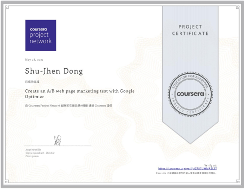

  <h1>
    Hi, I'm Shu-Jhen Dong.
  </h1>
  

    You can just call me by my English name, Anna. 
    Nice to meet you.
  

  
I'm a `Frontend Web Developer`.

  
持續學習，累積經驗，創造價值。

[![Website][shields-Website]][url-website]
[![GitHub][shields-GitHub]][url-github]
[![Codepen][shields-Codepen]][url-codepen]
[![LinkedIn][shields-LinkedIn]][url-linkedin]
[![CakeResume][shields-CakeResume]][url-cakeresume]

| 常用的程式語言 | GitHub 統計數據 |
| :--: | :--: |
| [![常用的程式語言][stats-top-langs]][url-github] | [![GitHub 統計數據][stats-theme-vue]][url-github] |

---

## 前端技術學習中

- 已學習：<code>HTML</code>、<code>CSS</code> (& <code>SCSS</code>)、<code>Javascript</code>
- 學習中：<code>jQuery</code>、<code>Bootstrap 5</code>、<code>Vue 3</code>、<code>GSAP</code>
- 預計學習：<code>Tailwind CSS</code>、<code>Node.js</code>、<code>React.js</code>

## 相關證書
### Coursera
- Create an A/B web page marketing test with Google Optimize [[course link]](https://www.coursera.org/projects/create-an-a-b-web-page-and-marketing-test-with-google-optimize)
  

    
查看證書

    
  

## 參加過的培訓課程

### 實體課程
- 上益資訊 / 數位方塊 - [前端工程師暨 JS 框架應用培訓班][url-sunyeh]

### 線上課程
- 六角學院 - [2022 公益程式體驗營][url-hexschool-experience-camp]、[2023 Node.js 軟體工程師企業專題班][url-hexschool-nodejs]
- Hahow 好學校 - [動畫互動網頁特效入門（JS/CANVAS）][url-hahow]

## 頁面統計數據
![visitors][badge-visitor]

[url-website]:https://shujhen.github.io/
[url-github]:https://github.com/shujhen/
[url-linkedin]:https://www.linkedin.com/in/shujhendong/
[url-codepen]:https://codepen.io/collection/xKqNap?grid_type=grid
[url-cakeresume]:https://www.cakeresume.com/s--enKtr0H7xZCIUWiPZCUZBg--/anna-dong
[url-sunyeh]:https://its.taiwanjobs.gov.tw/Course/Detail?ID=146386
[url-hexschool-experience-camp]:https://www.hexschool.com/2022/03/18/2022-03-18-global-welfare/
[url-hexschool-nodejs]:https://www.hexschool.com/2023/01/31/2023-01-31-nodejs-live-course/
[url-hahow]:https://hahow.in/cr/monoame-webdesign2

[stats-top-langs]:https://github-readme-stats.vercel.app/api/top-langs/?username=shujhen&layout=compact
[stats-theme-vue]: https://github-readme-stats.vercel.app/api?username=shujhen&theme=vue&show_icons=true

[shields-Website]:https://img.shields.io/badge/個人網站-shujhen.github.io-red
[shields-GitHub]:https://img.shields.io/badge/GitHub-24292f?logo=github
[shields-LinkedIn]:https://img.shields.io/badge/LinkedIn-blue?logo=linkedin
[shields-Codepen]:https://img.shields.io/badge/Codepen-000000?logo=codepen
[shields-CakeResume]:https://img.shields.io/badge/CakeResume-13ab67

[badge-visitor]:https://visitor-badge.laobi.icu/badge?page_id=shujhen
